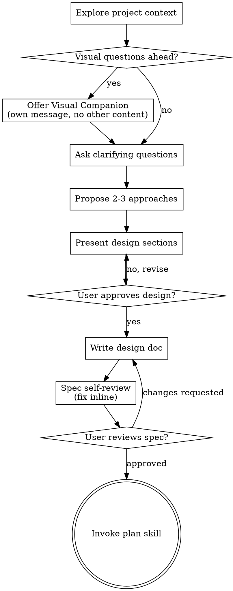

# Brainstorming Ideas Into Designs

Help turn ideas into fully formed designs and specs through natural collaborative dialogue.

Start by understanding the current project context, then ask questions one at a time to refine the idea. Once you understand what you're building, present the design and get user approval.

<HARD-GATE>
Do NOT invoke any implementation skill, write any code, scaffold any project, or take any implementation action until you have presented a design and the user has approved it. This applies to EVERY project regardless of perceived simplicity.
</HARD-GATE>

## Anti-Pattern: "This Is Too Simple To Need A Design"

Every project goes through this process. A todo list, a single-function utility, a config change — all of them. "Simple" projects are where unexamined assumptions cause the most wasted work. The design can be short (a few sentences for truly simple projects), but you MUST present it and get approval.

## Checklist

You MUST create a task for each of these items and complete them in order:

1. **Explore project context** — check files, docs, recent commits
2. **Offer visual companion** (if topic will involve visual questions) — this is its own message, not combined with a clarifying question. See the Visual Companion section below.
3. **Ask clarifying questions** — one at a time, understand purpose/constraints/success criteria
4. **Propose 2-3 approaches** — with trade-offs and your recommendation
5. **Present design** — in sections scaled to their complexity, get user approval after each section
6. **Write design doc** — save to `.claude/plans/YYYY-MM-DD-<topic>-design.md`
7. **Spec self-review** — quick inline check (see below)
8. **User reviews written spec** — ask user to review the spec file before proceeding
9. **Transition to implementation** — invoke `plan` skill to create implementation plan

## Process Flow



**The terminal state is invoking the `plan` skill.** Do NOT invoke any implementation skill directly. The ONLY skill you invoke after brainstorming is `plan`.

## The Process

**Understanding the idea:**

- Check out the current project state first (files, docs, recent commits)
- Before asking detailed questions, assess scope: if the request describes multiple independent subsystems, flag this immediately. Don't spend questions refining details of a project that needs to be decomposed first.
- If the project is too large for a single spec, help the user decompose into sub-projects. Each sub-project gets its own spec → plan → implementation cycle.
- For appropriately-scoped projects, ask questions one at a time to refine the idea
- Prefer multiple choice questions when possible, but open-ended is fine too
- Only one question per message
- Focus on understanding: purpose, constraints, success criteria

**Questioning style:**

- **Short questions.** 1-2 sentences. No preamble, no restating what the user said.
- **Short options.** Label + brief phrase, not a paragraph per option.
  ```
  ✅ A) Event-driven  B) Polling  C) Hybrid — I'd lean A because [one reason]
  ❌ "Option A would be an event-driven approach where we create a system that listens for..."
  ```
- **Lead with recommendation** in one line, not a paragraph of reasoning.
- **Skip the question** if you can infer the answer from context — state your assumption and move on.

**Exploring approaches:**

- Propose 2-3 different approaches with trade-offs
- Short labels with one-line trade-offs, not paragraphs per option
- Lead with your recommended option and explain why in one sentence

**Presenting the design:**

- Once you believe you understand what you're building, present the design
- Scale each section to its complexity: a few sentences if straightforward, up to 200-300 words if nuanced
- Ask after each section whether it looks right so far
- Cover: architecture, components, data flow, error handling
- Be ready to go back and clarify if something doesn't make sense

**Design for isolation and clarity:**

- Break the system into smaller units that each have one clear purpose, communicate through well-defined interfaces, and can be understood and tested independently
- Smaller, well-bounded units are also easier to work with — you reason better about code you can hold in context at once, and your edits are more reliable when files are focused.

**Working in existing codebases:**

- Explore the current structure before proposing changes. Follow existing patterns.
- Where existing code has problems that affect the work, include targeted improvements as part of the design.
- Don't propose unrelated refactoring. Stay focused on what serves the current goal.

## After the Design

**Documentation:**

- Write the validated design (spec) to `.claude/plans/YYYY-MM-DD-<topic>-design.md`
  - Project-specific work → `<project>/.claude/plans/`
  - Global/cross-project work → `~/.claude/plans/`
  - There is no separate `specs/` folder — specs and plans share the `plans/` folder
  - User preferences for location override these defaults

**Spec Self-Review:**
After writing the spec document, look at it with fresh eyes:

1. **Placeholder scan:** Any "TBD", "TODO", incomplete sections, or vague requirements? Fix them.
2. **Internal consistency:** Do any sections contradict each other? Does the architecture match the feature descriptions?
3. **Scope check:** Is this focused enough for a single implementation plan, or does it need decomposition?
4. **Ambiguity check:** Could any requirement be interpreted two different ways? If so, pick one and make it explicit.

Fix any issues inline. No need to re-review — just fix and move on.

**For complex, multi-system specs:** Consider dispatching a spec-reviewer subagent (see `~/.claude/skills/brainstorm/spec-reviewer-prompt.md`) for a thorough independent review.

**User Review Gate:**
After the spec review passes, ask the user to review:

> "Spec written to `<path>`. Please review it and let me know if you want to make any changes before we start writing the implementation plan."

Wait for the user's response. Only proceed once the user approves.

**Implementation:**

- Invoke the `plan` skill to create a detailed implementation plan
- Do NOT invoke any other skill. `plan` is the next step.

## Chaining

**Writes handoff to:** `.claude/handoffs/brainstorm-to-plan.md`
**Chains to:** `plan`

Before suggesting `plan`, write a handoff file:

```markdown
---
from: brainstorm
to: plan
spec: <path to spec doc>
---

- **Decisions:** [key decisions made — approach chosen, trade-offs resolved, scope boundaries]
- **Files touched:** [files read or identified for modification during discovery]
- **User preferences:** [constraints, style preferences, explicit user requests]
- **Skip:** plan Phase 1 (Understand scope), plan Phase 2 (File discovery)
```

Then suggest-and-confirm:
> "Spec written to `<path>`. Ready to move to plan. Proceed?"

Wait for user response. If yes → invoke `plan`. If no → conversation continues normally.

## Light Mode

When routing classifies the task as **light** (see routing skill's Complexity Classification), collapse the process:

1. **Skip** visual companion offer
2. **0-1 clarifying questions** — only if genuinely ambiguous. If intent is clear, skip questions entirely.
3. **Skip** "propose 2-3 approaches" — go with the obvious approach
4. **Present design as a short paragraph** — not per-section with approval gates
5. **Skip** spec self-review and user-reviews-spec gate
6. **Spec file** — write a brief spec to `.claude/plans/` if chaining to `plan`. Skip if task is trivial enough to implement directly.
7. **Transition** — suggest `plan` (or direct implementation if trivial) with a one-line confirm

The HARD-GATE still applies: present the design (even if short) and get approval before implementation. Light mode compresses the *process*, not the *discipline*.

**Light mode checklist (replaces the full checklist above):**

1. Quick context check (skim relevant files)
2. 0-1 clarifying questions
3. Present short design paragraph, get approval
4. Transition to plan or implementation

## Key Principles

- **One question at a time** — Don't overwhelm with multiple questions
- **Multiple choice preferred** — Easier to answer than open-ended when possible
- **YAGNI ruthlessly** — Remove unnecessary features from all designs
- **Explore alternatives** — Always propose 2-3 approaches before settling
- **Incremental validation** — Present design, get approval before moving on
- **Be flexible** — Go back and clarify when something doesn't make sense

## Visual Companion

A browser-based companion for showing mockups, diagrams, and visual options during brainstorming. Available as a tool — not a mode.

**Offering the companion:** When you anticipate that upcoming questions will involve visual content (mockups, layouts, diagrams), offer it once for consent:
> "Some of what we're working on might be easier to explain if I can show it to you in a web browser. I can put together mockups, diagrams, comparisons, and other visuals as we go. This feature is still new and can be token-intensive. Want to try it? (Requires opening a local URL)"

**This offer MUST be its own message.** Do not combine it with other content. Wait for the user's response.

**Per-question decision:** Even after the user accepts, decide FOR EACH QUESTION whether to use the browser or the terminal. The test: **would the user understand this better by seeing it than reading it?**

- **Use the browser** for visual content — mockups, wireframes, layout comparisons, architecture diagrams
- **Use the terminal** for text content — requirements questions, conceptual choices, tradeoff lists

If they agree to the companion, read the detailed guide:
`~/.claude/skills/brainstorm/visual-companion.md`
