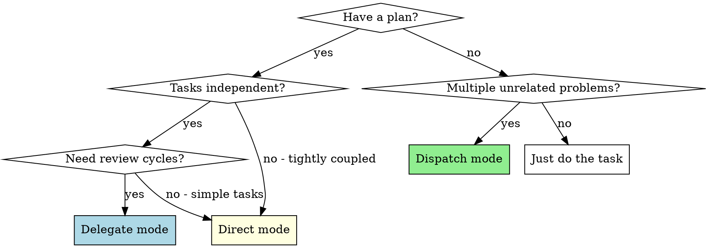
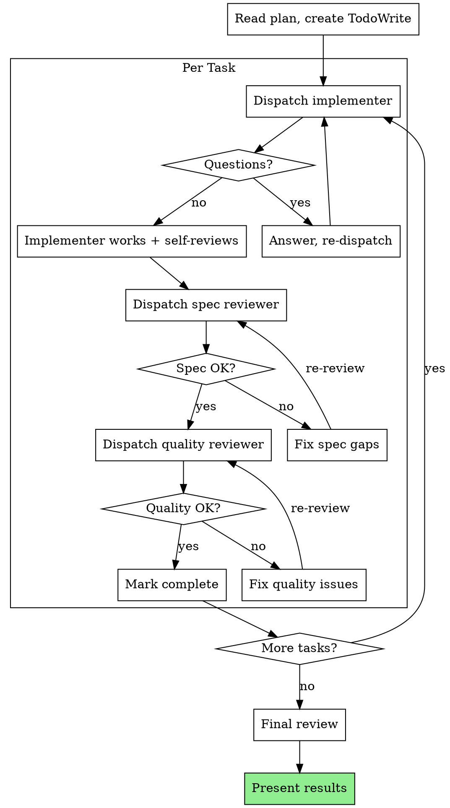

# Execute

## Overview

Execute implementation plans through the best mode for the situation: work directly, delegate to subagents with review cycles, or dispatch independent tasks in parallel.

**Core principle:** Match execution mode to task characteristics. Simple sequential tasks → direct. Independent tasks needing review → delegate. Unrelated parallel problems → dispatch.

## When to Use

- You have a written plan to implement
- You have 2+ independent tasks that can run in parallel
- You need to assign work to subagents with review cycles

**Do NOT use when:**
- No plan exists yet — use `brainstorm` then `plan` first
- Exploratory debugging — use `debug` first
- Single simple task — just do it directly

---

## Step 0: Check for Handoff

Before starting, check for a handoff file:

1. Look for `.claude/handoffs/plan-to-execute.md`
2. If found → read it, use the `plan` path, honor `Skip` list, pre-load mode recommendation
3. If not found → run full process as normal

| Handoff field | What it skips |
|---|---|
| Decisions (mode recommendation) | Mode selection question — confirm recommendation instead of asking from scratch |
| Files touched | File list is already known from the plan |
| Skip (plan review) | Skip critical plan review — plan skill already wrote it |

**Staleness check:** If plan file has changed since handoff was written, re-read and review the plan fully.

After consuming the handoff, delete the handoff file.

---

## Mode Selection



| Mode | When | How |
|------|------|-----|
| **Direct** | Tightly coupled tasks, simple plans | You implement each task sequentially |
| **Delegate** | Independent tasks needing quality review | Fresh subagent per task + two-stage review |
| **Dispatch** | Unrelated problems, parallel investigations | One agent per problem domain, all at once |

**Questioning style (when confirming mode or asking about execution preferences):**

- **Short questions.** "Direct or delegate?" not "Would you prefer to use direct mode where I implement sequentially, or delegate mode where..."
- **State your recommendation** in one line, ask for confirmation. Don't explain all options unless asked.

---

## Direct Mode

Load plan, review critically, execute all tasks yourself, report when complete.

### Process

1. **Load and review plan** — identify concerns, raise with user before starting
2. **Execute tasks** — mark each in_progress → follow steps exactly → verify → mark completed
3. **Complete** — present results, list files changed, note deviations

### When to Stop

- Hit a blocker (missing dependency, verification fails, instruction unclear)
- Plan has critical gaps
- Verification fails repeatedly

**Ask for clarification rather than guessing.**

---

## Delegate Mode

Spawn a fresh subagent per task with two-stage review (spec compliance then code quality).

**Why subagents:** Isolated context keeps each agent focused. They never inherit your session history — you construct exactly what they need. This preserves your context for coordination.

### Process



### Model Selection

Use the least powerful model that handles each role:

- **Mechanical tasks** (1-2 files, clear spec) → fast, cheap model
- **Integration tasks** (multi-file, pattern matching) → standard model
- **Architecture/review tasks** → most capable model

### Handling Implementer Status

| Status | Action |
|--------|--------|
| **DONE** | Proceed to spec review |
| **DONE_WITH_CONCERNS** | Read concerns. If correctness issue → address before review. If observation → note and proceed |
| **NEEDS_CONTEXT** | Provide missing context, re-dispatch |
| **BLOCKED** | Context problem → more context. Needs reasoning → more capable model. Too large → break down. Plan wrong → escalate to user |

### Prompt Templates

- `~/.claude/skills/execute/implementer-prompt.md` — dispatch implementer subagent
- `~/.claude/skills/execute/spec-reviewer-prompt.md` — dispatch spec compliance reviewer
- `~/.claude/skills/execute/code-quality-reviewer-prompt.md` — dispatch code quality reviewer

---

## Dispatch Mode

For unrelated, independent problems that can be investigated or fixed in parallel.

### Independence Criteria

Use dispatch when:
- 3+ files/systems with different root causes
- Multiple subsystems broken independently
- Each problem needs no context from others
- No shared state between tasks

Don't use when:
- Failures are related (fix one might fix others)
- Need full system state understanding
- Agents would edit the same files

### Process

1. **Identify independent domains** — group by what's broken
2. **Create focused agent tasks** — each gets: specific scope, clear goal, constraints, expected output
3. **Dispatch all at once** — ALL agents in a single response as multiple Agent tool calls
4. **Review and integrate** — read summaries, verify no conflicts, run full verification

### Agent Prompt Structure

Good agent prompts are:
1. **Focused** — one clear problem domain
2. **Self-contained** — all context needed to understand the problem
3. **Specific about output** — what should the agent return?

---

## Red Flags

**Never:**
- Skip reviews in delegate mode (spec compliance OR code quality)
- Proceed with unfixed issues
- Dispatch implementation subagents in parallel (conflicts)
- Make subagent read plan file (provide full text instead)
- Ignore subagent questions or escalations
- Accept "close enough" on spec compliance
- Start quality review before spec compliance passes

**If subagent asks questions:** Answer clearly and completely.
**If reviewer finds issues:** Implementer fixes, reviewer re-reviews. Repeat until approved.
**If subagent fails:** Dispatch fix subagent with specific instructions. Don't fix manually (context pollution).

## Light Mode

When routing classifies the task as **light**, streamline execution:

1. **Skip mode selection** — default to direct mode
2. **Skip formal plan review** — load plan and start executing
3. **Execute and report** — implement tasks, present results when done

Light mode still follows plan steps and verifies work. It just removes the selection ceremony and review gates for straightforward plans.

## Common Mistakes

| Mistake | Fix |
|---------|-----|
| Wrong mode for the task | Check mode selection flowchart |
| Too broad dispatch scope | One specific domain per agent |
| No context in dispatch prompt | Include error messages, file paths, relevant code |
| Sequential dispatch | ALL agents in one response |
| Skipping plan review | Always review critically before executing |

## Chaining

**Reads handoff from:** `.claude/handoffs/plan-to-execute.md`
**Writes handoff to:** `.claude/handoffs/execute-to-review.md`
**Chains to:** `review`, then all → `verify`

After completing all tasks, write a handoff file:

```markdown
---
from: execute
to: review
plan: <path to plan doc>
---

- **Decisions:** [what was implemented, any deviations from plan, task completion status]
- **Files touched:** [all files created or modified during execution]
- **User preferences:** [any preferences expressed during execution]
- **Skip:** review context gathering (already knows what changed and why)
```

Then suggest-and-confirm:
> "Execution complete. Ready to move to review. Proceed?"

## Integration

**Related skills:**
- `plan` — creates the plan this skill executes
- `review` — code review for completed work
- `verify` — verify work before claiming completion
